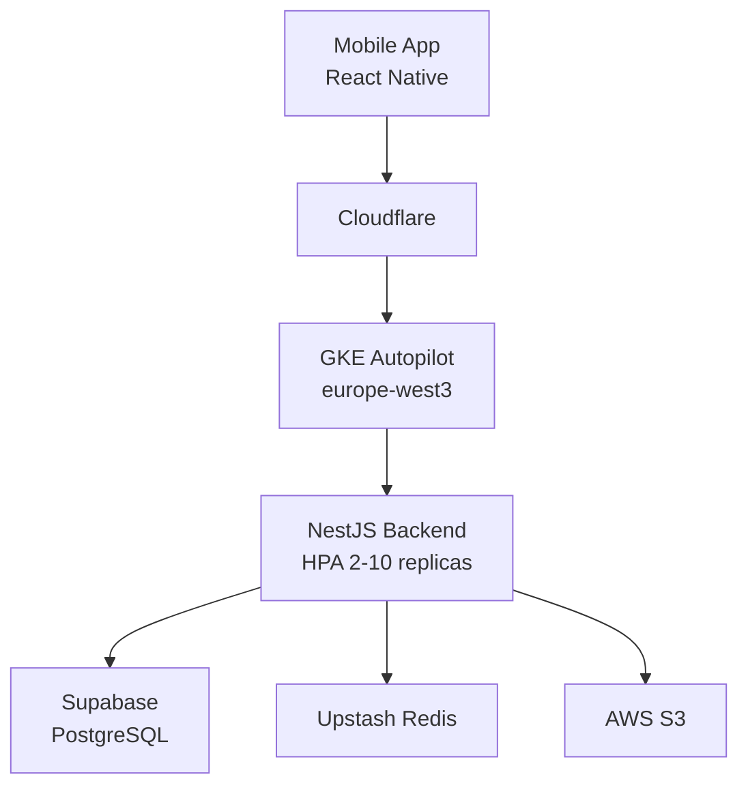

# Kampüsümden

[](https://github.com/beyzanurkaracam/kampus_dolap/actions/workflows/deploy.yml)
[](https://github.com/beyzanurkaracam/kampus_dolap/actions/workflows/ci.yml)
[](LICENSE)

Üniversite öğrencileri için kampüs içi C2C ikinci el pazaryeri. Sadece `.edu.tr` e-posta adresiyle kayıt, kargo yok, elden teslim.

## Mimari



## Tech Stack

| Katman | Teknoloji |
|--------|-----------|
| Mobile | React Native, TypeScript |
| Backend | NestJS, TypeScript |
| Database | PostgreSQL (Supabase) |
| Cache / WebSocket | Redis (Upstash) |
| Storage | AWS S3 |
| Infra | GKE Autopilot, Terraform |
| CI/CD | GitHub Actions + WIF |
| Observability | Sentry, Pino, GCP Monitoring |

## CI/CD Akışı

```
develop'a push → CI (lint/test/scan) → staging deploy → smoke test
main'e merge  → CI (lint/test/scan) → staging deploy → manuel onay → prod deploy
```

## Hızlı Deploy

```bash
# Staging
kubectl apply -k backend/k8s/overlays/staging

# Production (CI/CD otomatik yapar, main'e merge et)
git push origin main
```

## Geliştirme Ortamı

```bash
# Backend
cd backend && npm install && npm run start:dev

# Mobile
npm install && npm run android
```

## Dokümantasyon

- [Mimari](docs/architecture.md)
- [Deployment & Rollback](docs/deployment.md)
- [Runbook](docs/runbook.md)
- [API Docs](https://api.kampusumden.online/api/docs)
